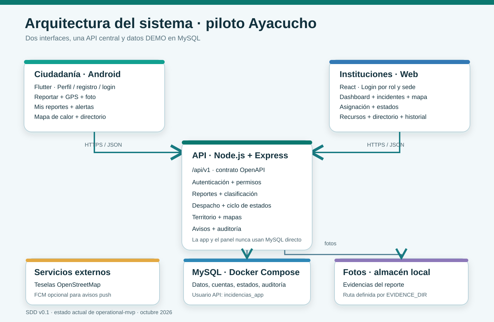

# Plataforma de gestión de incidencias

Monorepo del piloto DEMO de Ayacucho descrito en el [SDD](SDD_Plataforma_Gestion_Desastres_Violencias_v0.1.md). Incluye app ciudadana Android (Flutter), panel institucional (React), API Node.js/Express y MySQL. El panel y la API están desplegados en Render; MySQL usa Aiven con TLS y las fotos nuevas se almacenan en Cloudinary.

## Empieza aquí

- [Abrir panel y login](https://gestion-incidencias-200e.onrender.com/login).
- [Guía de usuarios y módulos](docs/USER_GUIDE.md): cuentas DEMO, permisos y recorrido de prueba.
- [Índice de documentación](docs/README.md): instalación, arquitectura, colaboración y validación SDD/OpenSpec.
- [App Android](apps/mobile/README.md): configuración de ambientes, compilación e instalación del APK.

El piloto utiliza datos de demostración y no constituye un servicio de atención de emergencias reales.



La app y el panel consumen `/api/v1`; solo la API se conecta a MySQL con `incidencias_app`. Las fotos se guardan fuera de MySQL. Los datos, cuentas y coberturas DEMO no sirven para despacho real.

## Estructura

| Ruta | Propósito |
| --- | --- |
| `apps/api` | Backend Node.js + Express, monolito modular. |
| `apps/admin` | Panel institucional React. |
| `apps/mobile` | App Flutter, Android primero. |
| `packages/contracts/openapi.yaml` | Contrato HTTP compartido. |
| `openspec` | Cambios y especificaciones de implementación. |

Tecnologías: Node.js 20.19+ o 22.12+ para el monorepo (requisito de Vite 8), Express 5, MySQL 9.7.2 local / 8.4.8 en Aiven, React 19, Vite 8, Flutter 3.38, Docker Compose y OpenAPI. El SDD original conserva la arquitectura y decisiones de diseño; [convenciones](docs/conventions.md), [validación del piloto](docs/pilot-validation.md) y [operación en Render](docs/RENDER_COLLABORATION.md) documentan su aplicación. OpenSpec conserva el historial de cambios.

## Entorno local

Requisitos: Docker Desktop con Compose. Desde PowerShell, en la raíz del repositorio:

```powershell
Copy-Item .env.example .env
# Editar .env: cambiar MYSQL_PASSWORD y MYSQL_ROOT_PASSWORD; elegir MYSQL_PORT.
docker compose config --quiet
docker compose up -d mysql
docker compose ps
```

Esperar el estado `healthy`. MySQL se publica solo en `127.0.0.1` mediante `MYSQL_PORT`; en esta estación el puerto configurado es `3307`. Si ese puerto está ocupado, elegir otro libre en `.env` antes de iniciar Compose. Para detener sin perder datos:

```powershell
docker compose down
```

El volumen `gestion-incidencias_mysql_data` se conserva. No usar `docker compose down -v` en el flujo normal. `MYSQL_DATABASE`, `MYSQL_USER` y las contraseñas del contenedor solo se aplican al inicializar un volumen vacío; cambiar esas variables después no modifica automáticamente la base ni las credenciales existentes.

## API técnica

Node.js 20 o posterior. Desde otra terminal PowerShell en la raíz del repositorio:

```powershell
Copy-Item apps/api/.env.example apps/api/.env
# Editar apps/api/.env: DB_PASSWORD debe ser la contraseña vigente de incidencias_app.
# En esta estación, DB_HOST=127.0.0.1 y DB_PORT=3307.
npm --prefix apps/api ci
npm --prefix apps/api start
```

El archivo `apps/api/.env` es independiente del `.env` raíz. El proceso Node.js usa `DB_USER=incidencias_app` y rechaza `root`. Si el volumen MySQL ya existía, la contraseña de la API debe coincidir con la cuenta existente; cambiar `MYSQL_PASSWORD` en el `.env` raíz no la actualiza.

En una tercera terminal PowerShell:

```powershell
Invoke-RestMethod http://127.0.0.1:3000/api/health
Invoke-RestMethod http://127.0.0.1:3000/api/health/database
```

El primer endpoint devuelve `{ "status": "ok" }` si HTTP funciona. El segundo devuelve `{ "status": "ok", "database": "connected" }` solo si `SELECT 1` funciona con MySQL; devuelve HTTP `503` con un error genérico si MySQL no está disponible. Detener Node.js con Ctrl+C para cerrar el servidor y el pool.

## Contrato y convenciones

El contrato está en [OpenAPI](packages/contracts/openapi.yaml). Las rutas funcionales usan `/api/v1`; los dos health checks técnicos usan `/api/health` y `/api/health/database`. Las convenciones de código y API están en [docs/conventions.md](docs/conventions.md).

## Mapa y directorio del piloto

La API expone `GET /api/v1/public/heatmap?from=...&to=...` sin autenticación. Acepta `type=emergency|security`, `categoryId`, `hour` (0–23 UTC), `districtId` e `institutionId`. El intervalo debe ser válido y no superar 90 días; la consulta se limita a 5 000 incidentes. Cada celda publicada tiene al menos tres incidentes de una categoría. Las categorías sensibles usan celdas de 0,2 grados y las restantes de 0,05 grados. `latitude` y `longitude` son el centro de la celda, no la ubicación de un reporte. No se envían descripciones, reportantes ni fotos. Estos controles son del piloto y no equivalen a anonimización formal ante consultas repetidas y cruzadas.

`GET /api/v1/ops/map` y `GET /api/v1/ops/stats` usan los mismos filtros y requieren token de SuperAdministrador, AdministradorInstitucional u Operador. La API comprueba el ámbito de cada incidente y sede antes de entregar puntos exactos o estadísticas. Para consultar el directorio, `GET /api/v1/public/directory?districtId=...` entrega contactos locales activos de ese distrito y contactos nacionales activos; sin contactos locales sigue devolviendo los nacionales. `POST /api/v1/admin/directory` y `PATCH/DELETE /api/v1/admin/directory/{id}` exigen administrador y registran cada cambio en auditoría.

En el mapa operativo, cada tipo de reporte tiene un pictograma y una etiqueta. La leyenda permite filtrar por tipo con un toque. Los puntos que se superponen se agrupan con un contador y un listado de reportes; al acercar el mapa se separan los puntos distintos. El mapa de calor público sigue usando solo celdas agregadas. El reporte ciudadano puede incluir un teléfono de contacto **opcional** para que la central devuelva la llamada. Este dato se muestra únicamente en el detalle autorizado del incidente, con acceso para llamar; no se publica en el mapa ni en el mapa de calor.

Ejemplo desde PowerShell, con API en ejecución:

```powershell
$from = [uri]::EscapeDataString((Get-Date).ToUniversalTime().AddDays(-1).ToString('o'))
$to = [uri]::EscapeDataString((Get-Date).ToUniversalTime().AddMinutes(1).ToString('o'))
Invoke-RestMethod "http://127.0.0.1:3000/api/v1/public/heatmap?from=$from&to=$to"
Invoke-RestMethod "http://127.0.0.1:3000/api/v1/public/directory?districtId=1"
```

Los clientes deben configurar la URL de teselas OpenStreetMap por entorno y mostrar la atribución visible `© OpenStreetMap contributors` junto al mapa. El servicio público de teselas requiere respetar su política de uso y no hacer descargas masivas. Las coberturas y contactos DEMO del piloto en Ayacucho son ficticios; no deben utilizarse para despacho real.

## Alertas, avisos y auditoría

`GET /api/v1/public/alerts?districtId=...` devuelve alertas activas y vigentes de ese distrito más las globales. Los administradores publican, corrigen o desactivan alertas mediante `/api/v1/admin/alerts`. `GET /api/v1/notifications/mine` y `PATCH /api/v1/notifications/{id}/read` permiten consultar y marcar los avisos propios. Un reporte nuevo avisa a los administradores y miembros institucionales con cobertura y regla de derivación; una asignación avisa al Operador designado y un cambio de estado al ciudadano que reportó. Estos avisos se guardan en MySQL antes de cualquier intento push. La campana del panel consulta los avisos sin leer periódicamente y enlaza al incidente; la app ciudadana conserva sus avisos en **Mis reportes**. `GET /api/v1/admin/audit` consulta eventos con límites de institución y sede.

FCM es opcional. Sin `FCM_PROJECT_ID`, la API arranca sin credenciales externas y los avisos internos funcionan. Para una prueba FCM, configurar en `apps/api/.env` un `FCM_PROJECT_ID` válido y definir `GOOGLE_APPLICATION_CREDENTIALS` en el entorno de PowerShell apuntando a un JSON de cuenta de servicio **fuera del repositorio**. El servidor usa [Firebase Admin SDK y credenciales ADC](https://firebase.google.com/docs/cloud-messaging/send/admin-sdk). Un cliente autenticado puede registrar su token mediante `POST /api/v1/notifications/devices` con `{ "token": "..." }` y desactivarlo mediante `DELETE /api/v1/notifications/devices/{id}`. La API nunca devuelve ni registra el token. Sin dispositivo registrado, o si FCM falla, la operación principal y el aviso interno permanecen guardados. El piloto limita la entrega a 20 dispositivos activos por usuario.

El buzón local `DEV_MAILBOX_DIR` de `apps/api/.env` sirve solo para enlaces de recuperación en desarrollo y queda fuera de Git. No usar contraseñas, claves de servicio ni tokens reales en `.env.example`, código, logs o commits.

## Panel institucional

Para arrancar en esta estación la base DEMO aislada, el panel y Android, seguir la [guía de prueba local de todos los módulos](docs/LOCAL_DEMO.md).

El panel React se inicia con `npm --prefix apps/admin run dev` después de copiar `apps/admin/.env.example` a `apps/admin/.env`; consultar su [guía de instalación](apps/admin/README.md). Para la demostración local se necesitan migraciones y seed DEMO de la API en la base elegida. Los componentes y el flujo institucional se verifican con `npm --prefix apps/admin test` y `npm --prefix apps/admin run build`.

Abrir la URL que imprima Vite, normalmente `http://127.0.0.1:5173/login`. Las cuentas de ejemplo son `operator-pnp@demo.invalid`, `admin-pnp@demo.invalid` y `superadmin@demo.invalid`. Usan la contraseña local `DEMO_PASSWORD` establecida al sembrar los datos; ninguna contraseña se guarda en Git. Operador ve Dashboard, Incidentes y Mapa de su ámbito. Administrador institucional también ve Instituciones, Unidades, Personal, Directorio e Historial según sus permisos. SuperAdministrador accede a todos los módulos del piloto. La API comprueba rol, institución y sede en cada operación.

## Aplicación ciudadana

La app Flutter Android vive en `apps/mobile`. Su [guía de instalación y prueba](apps/mobile/README.md) describe permisos, URL de API por `--dart-define`, emulador Android, GPS manual, fotos, reintentos y las siete vistas ciudadanas. En `apps/mobile`, ejecutar `flutter pub get`, `flutter analyze` y `flutter test` antes de iniciar un dispositivo.

En Android, abrir **Perfil** para crear una cuenta ciudadana o iniciar sesión. La cuenta permite ver **Mis reportes** y adjuntar fotos; un invitado puede enviar un reporte preliminar. Las otras vistas son Inicio, Reportar, Mapa, Alertas y Directorio. La configuración única está en `apps/mobile/lib/core/config.dart`: producción usa Render por defecto. Desarrollo exige `APP_ENV=development` y una `API_BASE_URL` explícita; consultar la guía móvil. No se incorporan contraseñas al APK.

## Estado y despliegue

El cambio OpenSpec `operational-mvp` mantiene pendiente su recorrido visual completo Android→panel→Android (tarea 12.3). Las suites API, React y Flutter y el contrato OpenAPI se verifican antes de publicar; los resultados concretos están en [validación del piloto](docs/pilot-validation.md) y en las guías de cada aplicación. El servicio público está en Render; [su guía](docs/RENDER_COLLABORATION.md) contiene comandos y configuración. El [plan V1 original](docs/DEPLOYMENT_V1.md) se conserva como referencia histórica de una topología distinta; no describe el despliegue actual. Cloudflare y un dominio propio quedan pendientes.

## Iteraciones

La secuencia vigente se encuentra en la sección 21 del SDD. Cada iteración debe actualizar el contrato y registrar sus criterios de aceptación antes de implementar endpoints o clientes que dependan de ellos.
