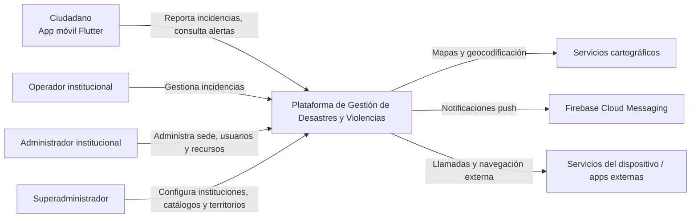
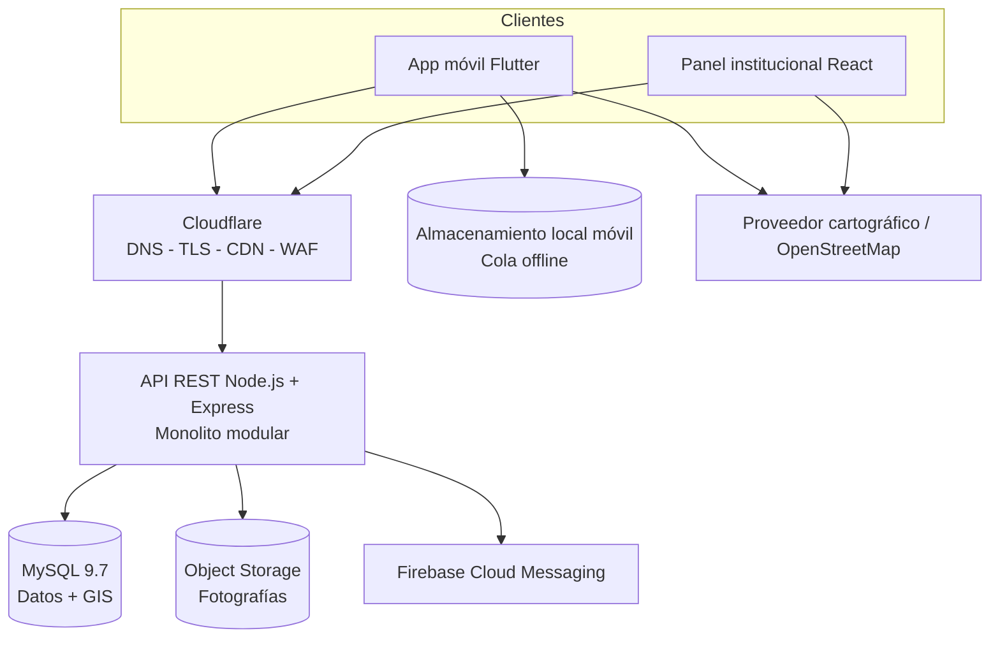
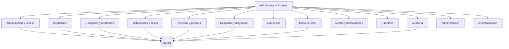
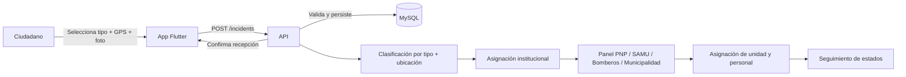
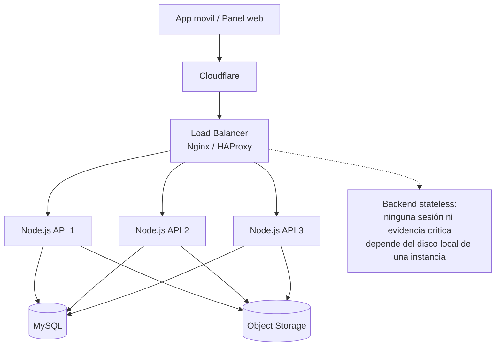

# SOFTWARE DESIGN DESCRIPTION (SDD)

## Plataforma móvil para la gestión de desastres, emergencias y violencias

**Universidad Nacional de San Cristóbal de Huamanga**  
**Ingeniería de Sistemas - Arquitectura de Software**

> **Nombre del producto:** por definir  
> **Alcance:** nacional, con piloto inicial en Ayacucho  
> **Versión:** 0.1 - Diseño base para implementación  
> **Fecha:** 05 de octubre de 2026

Documento preparado para orientar la implementación incremental mediante metodología SDD y asistencia de IA.

# Control del documento

| **Campo**             | **Valor**                                                                                                                           |
|-----------------------|-------------------------------------------------------------------------------------------------------------------------------------|
| Propósito             | Definir la arquitectura, módulos, datos, interfaces, requisitos no funcionales, seguridad, despliegue y evolución de la plataforma. |
| Ámbito                | Diseño para Perú; validación y piloto inicial en Ayacucho.                                                                          |
| Arquitectura base     | Monolito modular, preparado para replicación horizontal del backend.                                                                |
| Cliente móvil         | Flutter, Android como primera plataforma; diseño compatible con futura publicación iOS.                                             |
| Panel institucional   | React web.                                                                                                                          |
| Backend               | Node.js + Express.                                                                                                                  |
| Base de datos         | MySQL 9.7, InnoDB, capacidades GIS.                                                                                                 |
| Edge                  | Cloudflare para DNS, SSL/TLS, CDN/caché estática, seguridad y gestión de bots.                                                      |
| Modelo arquitectónico | C4 hasta nivel 3 (Contexto, Contenedores y Componentes), más vista de despliegue.                                                   |

| Nota de diseño: El nombre comercial del sistema, el proveedor definitivo del backend/MySQL y el dominio todavía no están cerrados. El diseño evita depender de esos nombres para que la implementación pueda avanzar hoy. |
|---------------------------------------------------------------------------------------------------------------------------------------------------------------------------------------------------------------------------|

# Contenido del SDD

1. Introducción y objetivos

2. Alcance y límites

3. Stakeholders y actores

4. Requisitos funcionales

5. Requisitos no funcionales

6. Reglas de negocio

7. Decisiones arquitectónicas

8. Arquitectura C4 (C1-C3)

9. Diseño de módulos

10. Diseño de datos y geolocalización

11. Interfaces y API

12. Flujos críticos

13. Seguridad y privacidad

14. Cloudflare y servicio en línea

15. Despliegue móvil, web y backend

16. Escalamiento horizontal

17. Mapas, mapa de calor y navegación

18. Modo offline y notificaciones

19. IA dentro del producto

20. Pruebas y criterios de aceptación

21. Plan de implementación con IA

22. Riesgos, costos y decisiones pendientes

23. Referencias técnicas

# 1. Introducción y objetivos

## 1.1 Propósito

Este SDD describe el diseño técnico de una plataforma móvil orientada al registro, geolocalización, clasificación, derivación y seguimiento de incidencias relacionadas con desastres, emergencias, tránsito, seguridad ciudadana y distintas formas de violencia. El documento sirve como contrato de diseño entre requisitos e implementación y como guía para desarrollar el sistema por módulos con apoyo de herramientas de inteligencia artificial.

## 1.2 Problema a resolver

Ante una emergencia o incidencia, el ciudadano puede desconocer qué institución debe atenderla, qué número llamar o cuál es la jurisdicción responsable. A su vez, las instituciones requieren información mínima, ubicación precisa, clasificación, trazabilidad y recursos disponibles para coordinar la atención. La plataforma propone un punto digital de entrada que no reemplaza los canales oficiales, sino que organiza reportes de incidencia y facilita su gestión operativa.

## 1.3 Objetivo general

Diseñar e implementar una plataforma móvil y web escalable que permita reportar incidencias con ubicación GPS, derivarlas según tipo y jurisdicción, gestionarlas por instituciones autorizadas y generar información geográfica agregada para apoyo operativo y preventivo.

## 1.4 Objetivos específicos

- Permitir al ciudadano reportar una incidencia con pocos pasos, GPS y foto opcional.

- Permitir reportes con cuenta y reportes como invitado; estos últimos se consideran preliminares/no verificados y no constituyen una denuncia formal.

- Identificar automáticamente departamento, provincia, distrito y zona de cobertura a partir de coordenadas, usando datos espaciales almacenados en MySQL.

- Clasificar y derivar incidencias a una o varias instituciones según reglas configurables.

- Proporcionar a PNP, SAMU, Bomberos y Municipalidad/Serenazgo paneles de gestión con usuarios individuales, unidades, personal y estados de atención.

- Visualizar mapas de calor agregados sin exponer públicamente ubicaciones exactas de casos sensibles.

- Ofrecer números y canales de emergencia pertinentes a la ubicación del usuario.

- Funcionar de manera tolerante a conectividad intermitente mediante una cola local de reportes pendientes.

- Preparar el backend para escalamiento horizontal y una prueba académica de hasta aproximadamente 5 000 usuarios concurrentes.

- Aplicar Cloudflare para dominio/DNS, SSL/TLS, seguridad perimetral, CDN/caché y control de rastreadores automatizados.

# 2. Alcance y límites

## 2.1 Alcance funcional

- Aplicación Android para ciudadanos (Flutter).

- Panel web institucional (React).

- API REST (Node.js + Express) compartida por ambos clientes.

- MySQL como gestor único de datos transaccionales y geoespaciales en esta etapa.

- Gestión de instituciones, sedes, jurisdicciones, usuarios, unidades, personal, incidencias, asignaciones, evidencias, alertas, directorio, auditoría y mapa de calor.

- Piloto de datos reales o demostrativos en Ayacucho, manteniendo estructura territorial para todo el Perú.

- Publicación móvil mediante APK/AAB y, cuando corresponda, Google Play.

## 2.2 Fuera de alcance inicial

- No sustituye llamadas oficiales, denuncias policiales, denuncias penales, historias clínicas ni sistemas de despacho institucional existentes.

- No se integra directamente a sistemas internos de PNP, SAMU, Bomberos o municipalidades sin convenios, APIs y autorizaciones formales.

- No realiza rastreo GPS continuo de ambulancias, patrulleros ni unidades; únicamente registra su estado operativo y asignación.

- No incluye video/audio como evidencia en la primera implementación; solo fotografías.

- No incluye navegación giro a giro propia; puede abrir una aplicación externa de navegación usando las coordenadas del incidente.

- No usa microservicios en la arquitectura inicial.

# 3. Stakeholders y actores

| **Actor**                   | **Responsabilidad**                                                                        | **Acceso principal**   |
|-----------------------------|--------------------------------------------------------------------------------------------|------------------------|
| Ciudadano registrado        | Reportar, consultar sus reportes, recibir alertas y usar directorio.                       | App móvil              |
| Ciudadano invitado          | Crear reporte preliminar con datos mínimos y consultar referencia de envío.                | App móvil / enlace web |
| Operador institucional      | Ver incidencias de su ámbito, verificar, cambiar estado y realizar asignaciones.           | Panel web              |
| Administrador institucional | Gestionar operadores, unidades, personal, sede, directorio y parámetros de su institución. | Panel web              |
| Superadministrador          | Gestionar instituciones, catálogos, jurisdicciones, permisos y configuración global.       | Panel web              |
| Personal de campo           | Ser asociado a una atención; en una evolución podrá recibir vista móvil específica.        | Indirecto inicialmente |
| Administrador técnico       | Despliegue, logs, respaldos, dominio, Cloudflare y monitoreo.                              | Infraestructura        |

# 4. Requisitos funcionales

| **ID** | **Requisito**                     | **Descripción**                                                                                                               |
|--------|-----------------------------------|-------------------------------------------------------------------------------------------------------------------------------|
| RF-01  | Registro de ciudadano             | Permitir crear cuenta con los datos mínimos necesarios y aceptar términos/privacidad.                                         |
| RF-02  | Reporte como invitado             | Permitir reportar sin cuenta; el reporte debe quedar marcado como no verificado y no constituir denuncia formal.              |
| RF-03  | Inicio de sesión                  | Autenticar ciudadanos y usuarios institucionales según su rol.                                                                |
| RF-04  | Recuperación de acceso            | Permitir recuperación segura de credenciales.                                                                                 |
| RF-05  | Selección de incidencia           | Mostrar categorías y subcategorías configurables: desastres, emergencias médicas, incendios, tránsito, seguridad y violencia. |
| RF-06  | Captura GPS                       | Solicitar permiso y capturar latitud, longitud, precisión y hora.                                                             |
| RF-07  | Corrección en mapa                | Permitir mover el marcador cuando la ubicación automática no corresponda al lugar real del incidente.                         |
| RF-08  | Foto de evidencia                 | Permitir adjuntar una o más fotografías con límites configurables.                                                            |
| RF-09  | Descripción breve                 | Permitir ingresar descripción y número estimado de afectados cuando aplique.                                                  |
| RF-10  | Persistencia offline              | Guardar localmente un reporte si no hay Internet y enviarlo posteriormente sin duplicarlo.                                    |
| RF-11  | Registro telefónico               | Permitir al operador crear manualmente un incidente recibido mediante llamada.                                                |
| RF-12  | Enlace de ubicación               | Generar un enlace temporal para que una persona que llamó pueda compartir su ubicación desde el navegador.                    |
| RF-13  | Identificación territorial        | Determinar departamento, provincia, distrito y zona a partir del punto geográfico.                                            |
| RF-14  | Clasificación por reglas          | Relacionar categoría/subcategoría con una o varias instituciones responsables.                                                |
| RF-15  | Derivación jurisdiccional         | Seleccionar las sedes con cobertura sobre el punto de la incidencia.                                                          |
| RF-16  | Asignación múltiple               | Permitir que una incidencia sea atendida por más de una institución.                                                          |
| RF-17  | Bandeja institucional             | Mostrar a cada operador únicamente incidencias permitidas por institución, sede, jurisdicción y rol.                          |
| RF-18  | Verificación                      | Permitir marcar la incidencia como verificada, no verificable, falsa o duplicada.                                             |
| RF-19  | Prioridad                         | Permitir asignar o corregir prioridad de atención según reglas operativas.                                                    |
| RF-20  | Estados de incidencia             | Gestionar Reportado, En verificación, Asignado, Unidad en camino, En atención, Resuelto y Cerrado.                            |
| RF-21  | Gestión institucional             | Registrar institución, tipo, datos de contacto y estado.                                                                      |
| RF-22  | Gestión de sedes                  | Registrar múltiples sedes por institución.                                                                                    |
| RF-23  | Zonas de cobertura                | Asignar uno o varios polígonos de cobertura a cada sede.                                                                      |
| RF-24  | Usuarios institucionales          | Crear cuentas individuales para administradores y operadores.                                                                 |
| RF-25  | Unidades/vehículos                | Registrar código, placa, tipo, capacidad/descripción, sede y estado.                                                          |
| RF-26  | Estados de unidad                 | Gestionar Disponible, Asignada, En camino, En atención, Retornando, Mantenimiento y Fuera de servicio.                        |
| RF-27  | Personal                          | Registrar personal operativo y su institución/sede.                                                                           |
| RF-28  | Asignar unidad                    | Asignar una o varias unidades disponibles a una incidencia.                                                                   |
| RF-29  | Asignar personal                  | Asociar personal a una atención.                                                                                              |
| RF-30  | Historial                         | Mantener línea de tiempo de cambios y responsables.                                                                           |
| RF-31  | Duplicados                        | Permitir vincular/fusionar reportes que describan un mismo evento.                                                            |
| RF-32  | Mapa institucional                | Visualizar incidencias autorizadas y ubicación exacta según permisos.                                                         |
| RF-33  | Mapa de calor público             | Mostrar concentración agregada de incidencias sin puntos sensibles exactos.                                                   |
| RF-34  | Filtros de mapa de calor          | Filtrar por tipo, fecha, franja horaria, distrito e institución.                                                              |
| RF-35  | Protección de casos sensibles     | Ocultar o degradar precisión espacial de violencia familiar, sexual u otras categorías sensibles en vistas públicas.          |
| RF-36  | Directorio de emergencia          | Mostrar números nacionales y números locales vinculados a territorio e institución.                                           |
| RF-37  | Llamada directa                   | Permitir iniciar llamada desde la app cuando el dispositivo lo soporte.                                                       |
| RF-38  | Alertas ciudadanas                | Publicar alertas por zona, tipo y periodo de vigencia.                                                                        |
| RF-39  | Notificaciones push               | Notificar cambios relevantes al ciudadano y nuevas asignaciones al personal institucional.                                    |
| RF-40  | Auditoría                         | Registrar acciones administrativas y operativas críticas.                                                                     |
| RF-41  | Administración de catálogos       | Gestionar tipos, subtipos, prioridades, estados y reglas de derivación.                                                       |
| RF-42  | Gestión de evidencias             | Consultar fotos únicamente con permisos autorizados y registrar accesos relevantes.                                           |
| RF-43  | Estadísticas operativas           | Mostrar conteos, tiempos de respuesta y distribución básica por tipo/zona.                                                    |
| RF-44  | Exportación controlada            | Permitir exportar datos agregados o autorizados para análisis posterior, por ejemplo Power BI.                                |
| RF-45  | Administración nacional escalable | Permitir incorporar nuevos departamentos, provincias, distritos, instituciones y sedes sin modificar el código fuente.        |

# 5. Requisitos no funcionales

| **ID** | **Atributo**              | **Criterio**                                                                                                                                                                                                 |
|--------|---------------------------|--------------------------------------------------------------------------------------------------------------------------------------------------------------------------------------------------------------|
| RNF-01 | Escalabilidad             | El backend deberá poder ejecutarse en múltiples instancias sin sesiones almacenadas localmente.                                                                                                              |
| RNF-02 | Concurrencia académica    | La arquitectura y las pruebas deberán contemplar escenarios progresivos de 100, 500, 1 000 y hasta aproximadamente 5 000 usuarios virtuales concurrentes, ajustando el escenario a los recursos disponibles. |
| RNF-03 | Rendimiento               | En carga normal, los endpoints transaccionales críticos deberán apuntar a p95 \< 2 s; el envío de una incidencia deberá confirmar persistencia sin esperar procesos secundarios.                             |
| RNF-04 | Disponibilidad            | La caída de una instancia del backend no debe interrumpir el servicio cuando existan réplicas activas y un balanceador.                                                                                      |
| RNF-05 | Seguridad de transporte   | Todo tráfico público deberá usar HTTPS/TLS.                                                                                                                                                                  |
| RNF-06 | Autorización              | Aplicar RBAC y filtros por institución/sede/jurisdicción.                                                                                                                                                    |
| RNF-07 | Contraseñas               | Almacenar hashes seguros (Argon2id o bcrypt), nunca contraseñas en texto plano.                                                                                                                              |
| RNF-08 | Privacidad                | Minimizar datos personales y limitar acceso a ubicaciones/evidencias sensibles.                                                                                                                              |
| RNF-09 | Auditoría                 | Las acciones críticas deben incluir actor, timestamp, entidad afectada, acción y cambios principales.                                                                                                        |
| RNF-10 | Tolerancia a conectividad | La app debe poder conservar reportes pendientes cuando pierda conexión.                                                                                                                                      |
| RNF-11 | Idempotencia              | Los reintentos de sincronización no deben crear reportes duplicados.                                                                                                                                         |
| RNF-12 | Integridad geográfica     | Los puntos y zonas deberán usar un SRID coherente y validarse antes de persistir.                                                                                                                            |
| RNF-13 | Mantenibilidad            | Backend organizado por módulos con límites claros y dependencias controladas.                                                                                                                                |
| RNF-14 | Observabilidad            | Incluir logs estructurados, identificador de solicitud y métricas mínimas de error/latencia.                                                                                                                 |
| RNF-15 | Respaldo                  | Definir respaldos automáticos de MySQL en producción y procedimiento de restauración probado.                                                                                                                |
| RNF-16 | Caché segura              | No cachear respuestas privadas o autenticadas en Cloudflare; priorizar recursos estáticos y datos públicos controlados.                                                                                      |
| RNF-17 | Accesibilidad/usabilidad  | El flujo de reporte debe ser corto, con botones visibles y lenguaje simple.                                                                                                                                  |
| RNF-18 | Compatibilidad            | Primera entrega Android; el diseño Flutter no debe bloquear futura compilación iOS.                                                                                                                          |
| RNF-19 | Portabilidad              | Los servicios de backend deberán poder ejecutarse mediante contenedores Docker en desarrollo/pruebas.                                                                                                        |
| RNF-20 | Separación de evidencias  | Las fotos no deberán almacenarse como BLOB masivos en MySQL; se guardará URL/clave y metadatos.                                                                                                              |

# 6. Reglas de negocio

| **Regla** | **Descripción**                                                                                                                     |
|-----------|-------------------------------------------------------------------------------------------------------------------------------------|
| RN-01     | Un reporte ciudadano representa una incidencia informativa/operativa; no equivale a una denuncia formal ante una autoridad.         |
| RN-02     | Un reporte sin cuenta se marca como invitado/no verificado y puede requerir validación adicional.                                   |
| RN-03     | La ubicación final del incidente puede diferir de la posición física del usuario; por eso el marcador puede corregirse.             |
| RN-04     | Una incidencia puede generar N asignaciones institucionales.                                                                        |
| RN-05     | Una sede solo recibe automáticamente incidencias si su tipo de institución y zona de cobertura coinciden con las reglas aplicables. |
| RN-06     | Si no existe cobertura configurada, el reporte se deriva a una bandeja de excepción/administración regional.                        |
| RN-07     | Solo usuarios autorizados pueden marcar un reporte como falso, duplicado o cerrado.                                                 |
| RN-08     | Una unidad en Mantenimiento/Fuera de servicio no puede asignarse.                                                                   |
| RN-09     | El mismo recurso no puede quedar asignado simultáneamente a dos atenciones incompatibles.                                           |
| RN-10     | Los casos sensibles nunca se muestran con coordenada exacta en el mapa público.                                                     |
| RN-11     | El mapa de calor público usa agregación espacial/temporal y un umbral mínimo de eventos por celda/zona antes de mostrar detalle.    |
| RN-12     | Los datos de personas y fotos solo se muestran a roles con necesidad operativa.                                                     |
| RN-13     | El cierre de una incidencia no elimina su auditoría.                                                                                |
| RN-14     | Los números nacionales y locales del directorio son configurables; no deben quedar cableados en la app.                             |
| RN-15     | Las reglas de derivación deben poder modificarse sin recompilar la app móvil.                                                       |
| RN-16     | Un reporte sincronizado offline debe conservar el identificador generado por el cliente para prevenir duplicación.                  |
| RN-17     | Los tiempos de respuesta se calculan desde el registro hasta hitos configurables (asignación, salida, llegada, resolución).         |
| RN-18     | Las alertas públicas requieren autor institucional, vigencia y zona.                                                                |

# 7. Decisiones arquitectónicas

| **ID** | **Decisión**           | **Justificación**                                                                                                                                                                 |
|--------|------------------------|-----------------------------------------------------------------------------------------------------------------------------------------------------------------------------------|
| ADR-01 | Monolito modular       | Se implementará un backend único organizado por dominios. Reduce complejidad para un equipo pequeño y mantiene una ruta clara hacia extracción de servicios si la carga lo exige. |
| ADR-02 | Stateless              | JWT y ausencia de sesión en memoria del servidor permiten replicar el backend horizontalmente.                                                                                    |
| ADR-03 | Node.js + Express      | Permite trabajar completamente desde VS Code, rápida construcción de API y ecosistema amplio.                                                                                     |
| ADR-04 | MySQL 9.7              | Se conserva el gestor disponible. Se usarán POINT/POLYGON con SRID 4326, funciones espaciales e índices SPATIAL.                                                                  |
| ADR-05 | Flutter Android-first  | Un único proyecto móvil permite GPS, cámara, almacenamiento local y notificaciones; Android será el primer canal.                                                                 |
| ADR-06 | React para panel       | Separa la experiencia institucional de la app ciudadana y facilita despliegue web.                                                                                                |
| ADR-07 | Fotos fuera de MySQL   | El objeto binario se guarda en object storage; MySQL conserva metadatos, integridad y referencia.                                                                                 |
| ADR-08 | Reglas antes que IA    | La clasificación/derivación inicial será determinística y auditable. IA se incorpora cuando existan datos etiquetados suficientes.                                                |
| ADR-09 | Cloudflare en el borde | DNS, TLS, caché estática y controles de seguridad se resuelven antes del origen.                                                                                                  |
| ADR-10 | C4 hasta C3            | Se documentan Contexto, Contenedores y Componentes; el nivel de código se generará durante implementación solo donde aporte valor.                                                |

# 8. Arquitectura C4

El modelo C4 organiza la descripción arquitectónica en niveles de zoom: contexto, contenedores, componentes y código. Para este trabajo se documentan C1, C2 y C3, que es el nivel indicado por el docente para la mayor parte del proyecto.

## 8.1 C1 - Contexto del sistema

Figura 1. C4 Nivel 1: contexto del sistema.

El sistema actúa como intermediario digital entre ciudadanos y personal institucional. Los servicios cartográficos y de notificaciones son dependencias externas; las instituciones se modelan dentro de la plataforma mediante cuentas, sedes y roles, sin afirmar integración oficial con sus sistemas internos.

## 8.2 C2 - Contenedores

Figura 2. C4 Nivel 2: contenedores principales.

En C4, “contenedor” significa aplicación o almacén de datos, no necesariamente Docker. La app Flutter y el panel React consumen la misma API. MySQL concentra datos transaccionales y geoespaciales. El almacenamiento de objetos conserva fotografías y el almacenamiento local móvil habilita el modo offline.

## 8.3 C3 - Componentes del backend

Figura 3. C4 Nivel 3: componentes del backend monolítico modular.

Los componentes se ejecutan dentro del mismo proceso Node.js durante la primera arquitectura. La división permite que, si las pruebas futuras muestran un cuello de botella específico, un componente pueda evolucionar a servicio independiente sin rediseñar el dominio completo.

# 9. Diseño de módulos

| **Módulo**                   | **Responsabilidad**                                                                                |
|------------------------------|----------------------------------------------------------------------------------------------------|
| M01 App Ciudadano            | Inicio, reporte rápido, GPS, foto, mapa de calor, mis reportes, alertas, directorio, modo offline. |
| M02 Autenticación y acceso   | Registro, login, recuperación, roles, permisos y tokens.                                           |
| M03 Incidencias              | Alta, edición controlada, prioridad, estados, duplicados, línea de tiempo.                         |
| M04 Geografía y jurisdicción | Perú/departamento/provincia/distrito/sector, puntos, polígonos, cobertura y consultas GIS.         |
| M05 Instituciones y sedes    | PNP, SAMU, Bomberos, Municipalidades/Serenazgo y sedes territoriales.                              |
| M06 Recursos                 | Vehículos/unidades, estado operativo, personal y disponibilidad.                                   |
| M07 Despacho                 | Derivación por reglas, asignación de instituciones, unidades y personal.                           |
| M08 Evidencias               | Carga, metadata, seguridad y consulta de fotografías.                                              |
| M09 Mapa de calor            | Agregación por espacio/tiempo/categoría, filtros y protección de casos sensibles.                  |
| M10 Alertas y notificaciones | Bandeja interna, alertas geográficas y FCM.                                                        |
| M11 Directorio               | Números nacionales, contactos locales y llamada directa.                                           |
| M12 Auditoría                | Trazabilidad de acciones y cambios.                                                                |
| M13 Administración           | Catálogos, usuarios, reglas, territorios y configuración.                                          |
| M14 Analítica básica         | Conteos, tiempos operativos y exportación futura a Power BI.                                       |

# 10. Diseño de datos y geolocalización

## 10.1 Entidades principales

| **Entidad**             | **Propósito**                                                    |
|-------------------------|------------------------------------------------------------------|
| Usuario                 | credenciales, estado, tipo de usuario, datos mínimos de contacto |
| Rol / Permiso           | control de acceso                                                |
| Institucion             | tipo: PNP, SAMU, Bomberos, Municipalidad, etc.                   |
| Sede                    | unidad territorial/operativa de una institución                  |
| ZonaCobertura           | POLYGON/MULTIPOLYGON SRID 4326 asociado a sede                   |
| Unidad                  | ambulancia, patrullero, autobomba, camioneta, etc.               |
| Personal                | personal operativo vinculado a sede                              |
| CategoriaIncidencia     | familia y subtipo                                                |
| Incidencia              | evento principal y datos del reporte                             |
| UbicacionIncidencia     | POINT SRID 4326, precisión, referencia y división territorial    |
| Evidencia               | metadata + object key/URL de foto                                |
| AsignacionInstitucional | relación N entre incidencia e instituciones/sedes                |
| AsignacionUnidad        | unidad asignada e hitos                                          |
| AsignacionPersonal      | personal asignado                                                |
| HistorialIncidencia     | cambios de estado                                                |
| Alerta                  | mensaje, zona, vigencia, emisor                                  |
| DirectorioEmergencia    | teléfono/canal + territorio                                      |
| Notificacion            | destinatario, tipo, estado de entrega                            |
| AuditLog                | actor, acción, entidad, IP/contexto                              |
| ReporteCliente          | clientRequestId para idempotencia/sincronización                 |

## 10.2 Estrategia GIS en MySQL

No es necesario cambiar a PostgreSQL/PostGIS para este proyecto. MySQL 9.7 dispone de tipos espaciales, índices SPATIAL y funciones para relaciones y distancias. Se propone almacenar ubicaciones como POINT SRID 4326 y coberturas como POLYGON/MULTIPOLYGON SRID 4326, con columnas NOT NULL e índices espaciales donde corresponda.

- Identificación de jurisdicción: buscar el polígono que contiene el POINT de la incidencia mediante ST_Contains/ST_Within.

- Distancia aproximada: ST_Distance_Sphere cuando sea útil ordenar sedes o recursos por cercanía, sin rastreo continuo de vehículos.

- Cobertura: cada sede puede tener uno o varios polígonos; la incorporación de nuevas localidades se realiza cargando datos, no cambiando código.

- Para el piloto se cargarán zonas demostrativas de Ayacucho; posteriormente pueden reemplazarse por límites administrativos oficiales y zonas institucionales validadas.

## 10.3 Retención propuesta

| **Dato**                       | **Prototipo académico**                                        | **Producción real**                                                       |
|--------------------------------|----------------------------------------------------------------|---------------------------------------------------------------------------|
| Incidencias                    | Conservar durante el proyecto y al menos 90 días para pruebas. | Definir política institucional/legal antes de operación real.             |
| Fotos                          | 90 días por defecto, configurable.                             | Según finalidad, consentimiento, normativa y procedimiento institucional. |
| Auditoría                      | 180 días mínimo en prototipo.                                  | Periodo definido por política institucional.                              |
| Tokens de ubicación compartida | Expiración breve (p. ej. 15-30 minutos).                       | Igual principio; mínimo tiempo necesario.                                 |
| Datos offline local            | Eliminar tras sincronización confirmada, salvo borrador.       | Igual.                                                                    |

| Nota de diseño: La retención definitiva no debe inventarse como obligación legal. Antes de producción real debe validarse con la institución titular del banco de datos y su asesoría legal. |
|----------------------------------------------------------------------------------------------------------------------------------------------------------------------------------------------|

# 11. Interfaces y API

## 11.1 Convenciones

- REST sobre HTTPS.

- Prefijo de versión: /api/v1.

- JSON para datos; multipart/form-data o carga firmada para fotos.

- JWT para acceso autenticado.

- Cabecera Idempotency-Key o clientRequestId para creación offline/reintentos.

- Errores con código estable, mensaje y correlationId.

## 11.2 Endpoints principales propuestos

| **Método** | **Ruta**                        | **Uso**                              |
|------------|---------------------------------|--------------------------------------|
| POST       | /auth/register                  | Registro ciudadano                   |
| POST       | /auth/login                     | Autenticación                        |
| POST       | /incidents                      | Crear incidencia                     |
| GET        | /incidents/mine                 | Mis reportes                         |
| GET        | /incidents/{id}                 | Detalle autorizado                   |
| POST       | /incidents/{id}/evidence        | Adjuntar foto                        |
| POST       | /location-share                 | Crear enlace temporal de ubicación   |
| POST       | /location-share/{token}         | Compartir coordenadas                |
| GET        | /public/directory               | Directorio por zona                  |
| GET        | /public/alerts                  | Alertas vigentes                     |
| GET        | /public/heatmap                 | Datos agregados para mapa de calor   |
| GET        | /ops/incidents                  | Bandeja institucional                |
| PATCH      | /ops/incidents/{id}/status      | Cambiar estado                       |
| POST       | /ops/incidents/{id}/assignments | Asignar institución/recurso/personal |
| POST       | /ops/incidents/{id}/merge       | Vincular/fusionar duplicado          |
| CRUD       | /admin/institutions             | Instituciones                        |
| CRUD       | /admin/sites                    | Sedes                                |
| CRUD       | /admin/coverage-zones           | Coberturas                           |
| CRUD       | /admin/units                    | Unidades                             |
| CRUD       | /admin/personnel                | Personal                             |
| CRUD       | /admin/users                    | Usuarios institucionales             |
| GET        | /admin/audit                    | Auditoría                            |

# 12. Flujos críticos

## 12.1 Reporte desde aplicación

Figura 4. Flujo principal de una incidencia reportada desde la app.

## 12.2 Clasificación y derivación

La respuesta debe ser rápida: el sistema primero persiste la incidencia y confirma recepción. Después aplica reglas de categoría + ubicación. Para categorías obvias, la derivación puede ser automática; el operador conserva capacidad de corregir la clasificación o agregar otra institución.

| **Ejemplo**                       | **Derivación inicial**                                                               |
|-----------------------------------|--------------------------------------------------------------------------------------|
| Emergencia médica                 | SAMU/servicio médico configurado; PNP/Bomberos si las reglas del subtipo lo indican. |
| Incendio                          | Bomberos; PNP/Municipalidad según configuración.                                     |
| Robo/asalto                       | PNP y/o Serenazgo de la zona.                                                        |
| Accidente de tránsito con heridos | PNP + SAMU; Bomberos cuando exista rescate.                                          |
| Deslizamiento/inundación          | Municipalidad/Defensa Civil y otras instituciones configuradas.                      |
| Violencia sensible                | Canal institucional autorizado; privacidad reforzada y sin ubicación exacta pública. |

## 12.3 Incidencia recibida por llamada

24. Operador selecciona “Registrar incidencia por llamada”.

25. Captura datos mínimos y la referencia proporcionada por la persona.

26. Puede marcar el punto en el mapa o enviar un enlace temporal de ubicación.

27. La persona abre el enlace, autoriza GPS y el punto se asocia al incidente.

28. El operador valida, clasifica y despacha la atención.

# 13. Seguridad y privacidad

| **Control**     | **Diseño**                                                                                                              |
|-----------------|-------------------------------------------------------------------------------------------------------------------------|
| Autenticación   | JWT de corta duración y refresh token controlado; MFA previsto para superadministrador/administradores institucionales. |
| RBAC            | Permisos por rol + institución + sede + jurisdicción.                                                                   |
| Contraseñas     | Argon2id o bcrypt; política de longitud y bloqueo/rate limit en intentos repetidos.                                     |
| Transporte      | HTTPS obligatorio; Cloudflare Universal SSL en borde y TLS hacia origen cuando el proveedor lo permita.                 |
| Datos sensibles | Ocultar datos personales y coordenadas exactas en vistas públicas; aplicar mínimo privilegio.                           |
| Fotos           | URLs no públicas o firmadas/temporales; validación de tipo/tamaño y eliminación de metadata innecesaria si corresponde. |
| Auditoría       | Registrar cambios de estado, asignaciones, cierres, administración y acceso a recursos sensibles cuando sea relevante.  |
| Abuso           | Rate limiting por IP/usuario/dispositivo, límites de tamaño y moderación de reportes anónimos.                          |
| Privacidad      | Consentimiento y aviso de privacidad; tratamiento conforme a la Ley N.° 29733 y su reglamento vigente.                  |
| Mapa de calor   | Solo agregados; aplicar umbral mínimo de eventos y degradación espacial para categorías sensibles.                      |

| Nota de diseño: Bot Fight Mode de Cloudflare no debe activarse indiscriminadamente sobre el tráfico de la API móvil: Cloudflare advierte que puede desafiar tráfico de API o aplicaciones móviles. Para la tarea del docente, se documentarán políticas de AI bots/robots y controles WAF sin romper api.\<dominio\>. |
|-----------------------------------------------------------------------------------------------------------------------------------------------------------------------------------------------------------------------------------------------------------------------------------------------------------------------|

# 14. Cloudflare y servicio en línea

## 14.1 Estructura de dominio propuesta

| **Host**          | **Destino**                 | **Uso**                                          |
|-------------------|-----------------------------|--------------------------------------------------|
| www.\<dominio\>   | Vercel                      | Página pública/landing y descargas informativas. |
| admin.\<dominio\> | Vercel                      | Panel institucional React.                       |
| api.\<dominio\>   | Proveedor backend           | API Node.js.                                     |
| media.\<dominio\> | Object storage/CDN opcional | Fotos autorizadas/recursos estáticos.            |

## 14.2 Configuración para la tarea

| **Elemento** | **Acción**                                                                                                                                     |
|--------------|------------------------------------------------------------------------------------------------------------------------------------------------|
| DNS          | Delegar nameservers del dominio a Cloudflare y crear registros para www, admin y api.                                                          |
| SSL/TLS      | Habilitar Universal SSL; preferir modo Full (strict) cuando el origen tenga certificado válido.                                                |
| HTTPS        | Forzar redirección HTTP→HTTPS.                                                                                                                 |
| CDN/Caché    | Cachear JS/CSS/imágenes y contenido público estable. No cachear login, incidencias, datos personales ni respuestas autenticadas.               |
| Seguridad    | WAF/rules disponibles en el plan, protección de rutas administrativas y rate limiting según disponibilidad/plan.                               |
| AI bots      | Configurar políticas de Search/Agent/Training o managed robots.txt según la demostración. Evitar Bot Fight Mode global si afecta la API móvil. |
| Evidencias   | Tomar capturas del DNS, SSL/TLS, reglas de caché, seguridad y configuración de bots para la entrega.                                           |
| Prueba       | Verificar certificado, headers, cache HIT/MISS en recursos estáticos y acceso correcto desde app/panel.                                        |

# 15. Despliegue móvil, web y backend

## 15.1 Aplicación Android

29. Durante desarrollo: flutter run en emulador o dispositivo físico.

30. Prueba de entrega: generar APK firmado o usar canal de pruebas interno.

31. Publicación: generar AAB con flutter build appbundle, firmarlo y subirlo a Google Play.

32. Google Play requiere cuenta de desarrollador; actualmente la cuota de registro es única de 25 USD y las cuentas personales deben cumplir requisitos de pruebas antes de producción.

## 15.2 Panel web

El panel React puede desplegarse inicialmente en Vercel y asociarse a admin.\<dominio\>. Cloudflare gestiona DNS/SSL frente al dominio. Vercel no hospeda la app Android; únicamente el panel web/página pública.

## 15.3 Backend y MySQL

El backend Node.js requiere un servicio que ejecute procesos de servidor de forma persistente. Para el piloto puede usarse un PaaS con plan gratuito cuando esté disponible. MySQL debe estar accesible desde el backend mediante conexión segura. El SDD evita comprometerse con un proveedor gratuito específico porque esos planes cambian; la aplicación se configura mediante variables de entorno para poder mover API y base de datos sin reescribir el sistema.

- DATABASE_URL / DB_HOST / DB_USER / DB_PASSWORD

- JWT_SECRET y claves de firma

- OBJECT_STORAGE\_\*

- FCM credentials

- CORS_ALLOWED_ORIGINS

- APP_ENV / LOG_LEVEL

# 16. Escalamiento horizontal

## 16.1 Diseño objetivo

Figura 5. Evolución a varias instancias del backend.

El escalamiento horizontal consiste en agregar instancias equivalentes del backend y repartir tráfico mediante un balanceador. El código debe ser stateless: ningún dato imprescindible de sesión o evidencia puede quedar únicamente en la memoria/disco local de una instancia.

## 16.2 Fases de escalamiento

| **Fase**              | **Topología**                                                                     | **Objetivo**                                                      |
|-----------------------|-----------------------------------------------------------------------------------|-------------------------------------------------------------------|
| A - Desarrollo        | 1 API + MySQL local                                                               | Funcionalidad y pruebas unitarias.                                |
| B - V1 en línea       | 1 API en PaaS + MySQL remoto + Cloudflare                                         | Demostración pública y tarea de dominio/SSL/caché/seguridad.      |
| C - Prueba horizontal | Nginx/HAProxy + 3 réplicas Node.js + MySQL                                        | Demostrar reparto de carga y tolerancia a caída de una instancia. |
| D - Evolución         | Múltiples hosts/instancias + DB optimizada/replicas si las métricas lo justifican | Escala real y mayor disponibilidad.                               |

## 16.3 Consideraciones para 1 000-5 000 usuarios

- Pruebas con k6 o JMeter, no con usuarios físicos.

- Escenarios separados: lectura pública, login, creación de incidencia y bandeja institucional.

- No incluir carga masiva contra los servidores públicos de teselas OpenStreetMap durante la prueba; se prueban nuestros endpoints.

- Usar pool de conexiones MySQL y límites de concurrencia razonables.

- Indexar FK, fecha, estado, institución y columnas espaciales utilizadas.

- Comprimir y limitar fotos; carga desacoplada cuando sea posible.

- Medir throughput, tasa de error, p50/p95/p99 y consumo de CPU/memoria.

- Si el origen gratuito no soporta la carga, ejecutar el experimento de réplica en Docker/Nginx y documentar la diferencia entre demostración académica y producción.

# 17. Mapas, mapa de calor y navegación

## 17.1 Mapa base

Para el piloto puede utilizarse OpenStreetMap mediante una biblioteca compatible en Flutter/React. Sus datos son reutilizables con atribución, pero los servidores públicos de teselas son best-effort, no ofrecen SLA y no deben someterse a uso masivo/prefetch. El diseño debe permitir sustituir la URL/proveedor de teselas sin publicar una nueva versión de la app.

## 17.2 Mapa de calor

- Fuente: incidencias válidas/operativas, no denuncias judiciales.

- Filtros: categoría, subtipo, intervalo de fechas, franja horaria, distrito e institución.

- Vista pública: agregada; nunca coordenadas exactas de violencia sensible.

- Vista institucional: puede mostrar puntos exactos únicamente con autorización.

- Implementación inicial: agregación por cuadrícula/geohash o zonas; no requiere Power BI.

- Power BI queda como integración analítica futura mediante exportación/API de datos agregados.

## 17.3 Cómo llegar al incidente

Para evitar pagar una API de navegación en la primera etapa, el panel mostrará las coordenadas y un botón “Abrir navegación” que puede abrir Google Maps, Waze u otra aplicación instalada. Una futura versión puede integrar un motor de rutas dedicado o autohospedado si se necesita navegación dentro de la plataforma.

# 18. Modo offline y notificaciones

## 18.1 Offline

33. El ciudadano completa el reporte incluso con conexión inestable.

34. La app genera clientRequestId UUID y guarda formulario + ruta local de foto en SQLite.

35. Si la API no responde, el reporte queda “Pendiente de envío”.

36. Al recuperar conectividad, la app reintenta.

37. El backend usa clientRequestId/idempotency para responder el mismo incidente si el envío ya había sido procesado.

38. Al confirmar, la app elimina la copia temporal sensible que ya no sea necesaria.

## 18.2 Push notifications

Firebase Cloud Messaging (FCM) se usará para notificaciones Android. La app registra un token de dispositivo; el backend lo asocia al usuario y solicita mensajes cuando una incidencia cambia de estado, se publica una alerta relevante o un operador recibe una nueva asignación.

# 19. Inteligencia artificial dentro del producto

Es viable incorporar IA con pocos recursos, pero no debe ser dependencia de la primera versión. Primero se construirá un flujo determinístico que genere datos de calidad. Luego se evaluarán modelos pequeños o servicios separados.

| **Etapa** | **Función**             | **Técnica recomendada**                                                                        |
|-----------|-------------------------|------------------------------------------------------------------------------------------------|
| Inicial   | Clasificación           | Reglas por categoría/subtipo seleccionados por el usuario.                                     |
| Inicial   | Duplicados              | Heurística: cercanía espacial + ventana temporal + categoría similar.                          |
| Futura    | Clasificación de texto  | Modelo supervisado ligero usando descripciones previamente validadas.                          |
| Futura    | Detección de duplicados | Similitud semántica + distancia + tiempo.                                                      |
| Futura    | Priorización asistida   | Modelo que sugiera prioridad; decisión final permanece en operador para casos críticos.        |
| Futura    | Predicción/análisis     | Tendencias temporales/espaciales con datos históricos, sin presentar predicciones como hechos. |

# 20. Pruebas y criterios de aceptación

| **Tipo**          | **Cobertura**                                                                                      |
|-------------------|----------------------------------------------------------------------------------------------------|
| Unitarias         | Reglas de clasificación, permisos, cambios de estado y validaciones GIS.                           |
| Integración       | API + MySQL + object storage + FCM (mock cuando sea necesario).                                    |
| E2E móvil         | Crear reporte, GPS, foto, offline, sincronización y consulta de estado.                            |
| E2E institucional | Login, bandeja, asignación, estados, cierre y auditoría.                                           |
| GIS               | Puntos dentro/fuera de polígonos, límites y fallback sin cobertura.                                |
| Seguridad         | RBAC, acceso cruzado entre instituciones, rate limit, validación de archivos y endpoints privados. |
| Carga             | Escenarios de 100/500/1k/5k VUs según capacidad; medir errores/latencia.                           |
| Failover          | Detener una réplica de API y verificar que el balanceador continúe con las restantes.              |
| Cloudflare        | HTTPS, DNS, caché de estáticos, bypass de API privada y políticas de bots.                         |
| Usabilidad        | Reporte de emergencia completado con pocos pasos y mensajes claros.                                |

## 20.1 Criterios mínimos de aceptación de la primera entrega funcional

- App Android instalada y comunicándose con API pública HTTPS.

- Ciudadano puede reportar con GPS, corregir marcador y adjuntar foto.

- Incidencia se persiste en MySQL y se asigna territorialmente con datos piloto de Ayacucho.

- Operador puede verla, verificarla, asignar unidad/personal y cambiar estados.

- Panel respeta roles y sede.

- Mapa de calor muestra agregados por filtros.

- Cloudflare configurado y evidenciado con capturas.

- Prueba de carga documentada con al menos una comparación entre una instancia y varias réplicas.

# 21. Plan de implementación mediante SDD + IA

Para evitar que la IA genere módulos incompatibles, cada iteración debe partir de este SDD y de contratos de datos/API. No se deben solicitar “todo el sistema” en un solo prompt.

| **Etapa**                                | **Entregable**                                                                                  |
|------------------------------------------|-------------------------------------------------------------------------------------------------|
| Iteración 0 - Entorno y estructura        | Monorepo; `.env.example`; Docker Compose MySQL; convenciones; OpenAPI inicial.                  |
| Iteración 1 - Base de datos y autenticación | Node/Express modular; migraciones MySQL; registro, login, RBAC y roles iniciales.             |
| Iteración 2 - Instituciones, sedes y usuarios | Territorio base, instituciones, sedes y usuarios institucionales.                           |
| Iteración 3 - Incidentes y GPS            | Categorías, reportes, ubicación, estados, historial y reglas de derivación.                     |
| Iteración 4 - Unidades, personal y asignaciones | Recursos operativos, disponibilidad y despacho múltiple.                                  |
| Iteración 5 - Mapa y jurisdicciones       | Coberturas geográficas, resolución territorial, mapas autorizados y pruebas GIS.                |
| Iteración 6 - App móvil completa          | Flutter: cuenta/invitado, reporte, GPS, mapa, foto, mis reportes, directorio, alertas y offline. |
| Iteración 7 - Panel institucional         | React: bandeja, mapa, despacho, gestión y estadísticas operativas.                              |
| Iteración 8 - Mapa de calor               | Agregados, filtros y protección espacial de casos sensibles.                                   |
| Iteración 9 - Despliegue                  | API y MySQL remotos, panel web, almacenamiento de fotos, notificaciones y observabilidad.       |
| Cloudflare                               | Dominio, DNS, TLS, caché, seguridad, políticas de bots y evidencias.                            |
| Escalamiento horizontal                  | Réplicas de API y balanceo; sesiones sin estado y gestión de conexiones.                        |
| Pruebas de carga de 1 000 a 5 000 usuarios | Escenarios graduales, métricas y comparación entre una instancia y varias réplicas.           |

La seguridad, auditoría, respaldos y retención se incorporan y verifican en las iteraciones pertinentes; el cierre del piloto revisa estos controles antes de usar datos reales.

## 21.1 Regla para prompts de programación

Cada solicitud a la IA debe contener: módulo objetivo, requisitos RF/RNF aplicables, entidades, endpoints, reglas de negocio, archivos permitidos a modificar, pruebas que deben pasar y criterio de terminado. Después de cada módulo se ejecutan pruebas y se realiza un commit independiente.

# 22. Riesgos, costos y decisiones pendientes

| **Riesgo**                         | **Mitigación**                                                                                               |
|------------------------------------|--------------------------------------------------------------------------------------------------------------|
| Datos jurisdiccionales incompletos | Usar zonas demostrativas en Ayacucho y mantener importación/configuración para reemplazarlas posteriormente. |
| Reportes falsos o abusivos         | Estado no verificado, moderación, rate limit, auditoría y cuentas confiables.                                |
| Ubicación GPS inexacta             | Guardar accuracy, permitir mover marcador y agregar referencia.                                              |
| Conectividad en desastre           | Cola offline; reconocer que sin red no puede existir atención en tiempo real.                                |
| Datos sensibles de violencia       | Restricción fuerte, anonimización espacial y validación legal antes de producción.                           |
| Plan gratuito insuficiente         | Mantener Docker/variables de entorno para migrar a un proveedor de pago sin reescribir.                      |
| Dependencia de tiles públicos      | Abstracción de proveedor; no hacer carga masiva sobre OSM público.                                           |
| 5k VUs exceden recursos locales    | Diseñar escenarios graduales y separar límites de infraestructura gratuita de la arquitectura.               |

## 22.1 Costos iniciales esperados

| **Concepto**                            | **Etapa académica**                                                                                                                    |
|-----------------------------------------|----------------------------------------------------------------------------------------------------------------------------------------|
| Flutter / Node.js / React / MySQL / Git | Sin licencia de pago.                                                                                                                  |
| Cloudflare Free                         | Puede cubrir DNS, Universal SSL, caché y varias funciones de bots/seguridad para la demostración.                                      |
| Vercel para panel                       | Plan gratuito sujeto a sus límites vigentes.                                                                                           |
| Backend/MySQL                           | Se prioriza free tier; si no es suficiente, requerirá PaaS/VPS de pago.                                                                |
| Mapas                                   | OSM puede utilizarse en piloto respetando su política; producción a escala puede requerir proveedor de tiles o infraestructura propia. |
| Google Play                             | Registro de desarrollador: 25 USD de pago único según documentación vigente.                                                           |
| Dominio                                 | Pendiente; varía por TLD y registrador.                                                                                                |

## 22.2 Decisiones abiertas que no bloquean el desarrollo

- Nombre comercial y dominio final.

- Proveedor definitivo de hosting Node.js y MySQL para producción.

- Datos oficiales de zonas de cobertura institucional; inicialmente serán demostrativos en Ayacucho.

- Política final de retención y tratamiento de evidencias en una implementación institucional.

- Proceso de validación con PNP, SAMU, Bomberos y Municipalidad.

- Cantidad final exigida por el docente para la prueba de concurrencia (diseño objetivo actual: hasta ~5 000 VUs).

# 23. Referencias técnicas

1\. IEEE Standards Association. IEEE 1016-2009, Software Design Descriptions. https://standards.ieee.org/ieee/1016/4502/

2\. C4 Model. The C4 model for visualising software architecture. https://c4model.com/

3\. MySQL 9.7 Reference Manual. Spatial Data Types, Spatial Functions and Spatial Index Optimization. https://dev.mysql.com/doc/refman/9.7/en/spatial-types.html

4\. Cloudflare Developers. Universal SSL. https://developers.cloudflare.com/ssl/edge-certificates/universal-ssl/

5\. Cloudflare Developers. Cache/CDN. https://developers.cloudflare.com/cache/

6\. Cloudflare Developers. Bot Fight Mode y AI bot policies. https://developers.cloudflare.com/bots/

7\. Flutter Documentation. Build and release an Android app. https://docs.flutter.dev/deployment/android

8\. Google Play Console Help. Registro de cuenta de desarrollador. https://support.google.com/googleplay/android-developer/answer/6112435?hl=es

9\. Firebase. Cloud Messaging for Flutter. https://firebase.google.com/docs/cloud-messaging/flutter/get-started

10\. OpenStreetMap Foundation. Tile Usage Policy. https://operations.osmfoundation.org/policies/tiles/

11\. Autoridad Nacional de Protección de Datos Personales. D.S. N.° 016-2024-JUS, Reglamento de la Ley N.° 29733. https://www.gob.pe/institucion/anpd/normas-legales/6554453-16-2024-jus

12\. Plataforma del Estado Peruano. Números de emergencia: PNP 105, SAMU 106, Bomberos 116 (directorio oficial consultado).

# Anexo A. Matriz resumida de roles

| **Función**                        | **Ciudadano** | **Operador**     | **Admin institucional** | **Superadmin** |
|------------------------------------|---------------|------------------|-------------------------|----------------|
| Crear reporte                      | Sí            | Sí (por llamada) | Sí                      | Sí             |
| Ver sus reportes                   | Sí            | \-               | \-                      | \-             |
| Ver bandeja institucional          | No            | Sí               | Sí                      | Sí             |
| Cambiar estado                     | No            | Sí               | Sí                      | Sí             |
| Asignar unidad/personal            | No            | Sí               | Sí                      | Sí             |
| Gestionar unidades/personal        | No            | No               | Sí                      | Sí             |
| Gestionar usuarios institucionales | No            | No               | Sí (su institución)     | Sí             |
| Gestionar instituciones/sedes      | No            | No               | Limitado                | Sí             |
| Configurar catálogos/reglas        | No            | No               | Limitado                | Sí             |
| Ver auditoría                      | No            | Limitado         | Sí (su ámbito)          | Sí             |

# Anexo B. Convenciones de estados

| **Estado**           | **Significado**                                        |
|----------------------|--------------------------------------------------------|
| Reportado            | El sistema confirmó recepción.                         |
| En verificación      | Un operador revisa datos.                              |
| Asignado             | Existe al menos una institución/recurso responsable.   |
| Unidad en camino     | Recurso inició desplazamiento.                         |
| En atención          | La atención está activa en campo.                      |
| Resuelto             | La situación operativa se considera atendida.          |
| Cerrado              | Caso cerrado administrativamente; permanece historial. |
| Falso/No verificable | Clasificación especial con motivo y auditoría.         |
| Duplicado            | Reporte enlazado a un incidente principal.             |

| Nota de diseño: Este documento es suficientemente específico para iniciar implementación. Antes de programar cada módulo, convertir sus requisitos en historias/tareas pequeñas y generar primero migraciones, contratos API y pruebas. Evitar incorporar microservicios, IA predictiva o integraciones institucionales reales hasta tener el flujo base medido y estable. |
|----------------------------------------------------------------------------------------------------------------------------------------------------------------------------------------------------------------------------------------------------------------------------------------------------------------------------------------------------------------------------|
