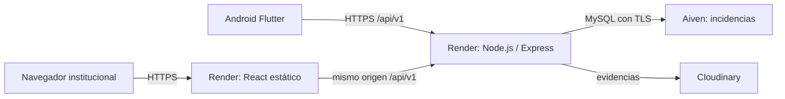

# Documentación del proyecto

## Elegir una guía

| Necesidad | Documento |
| --- | --- |
| Entender requisitos, arquitectura e iteraciones | [SDD v0.1](../SDD_Plataforma_Gestion_Desastres_Violencias_v0.1.md) |
| Probar cuentas, módulos y flujo ciudadano → institución | [Guía de usuarios](USER_GUIDE.md) |
| Instalar el monorepo | [README principal](../README.md) |
| Arrancar los módulos con datos locales existentes | [DEMO local](LOCAL_DEMO.md) |
| Configurar API, TLS, evidencias y comprobaciones | [API](../apps/api/README.md) |
| Desarrollar el panel | [React](../apps/admin/README.md) |
| Compilar e instalar Android | [Flutter](../apps/mobile/README.md) |
| Colaborar y mantener el despliegue vigente | [Render y Git](RENDER_COLLABORATION.md) |
| Revisar contrato HTTP | [OpenAPI](../packages/contracts/openapi.yaml) |
| Consultar resultados y pendientes de aceptación | [Validación del piloto](pilot-validation.md) |
| Revisar migraciones remotas | [Informe Aiven](AIVEN_SCHEMA_MIGRATION_REPORT.md) |
| Seguir convenciones de desarrollo | [Convenciones](conventions.md) |

## Arquitectura vigente

Las credenciales de base de datos, JWT y Cloudinary pertenecen al backend. El navegador y el APK contienen únicamente configuración pública.

## Trabajo según SDD y OpenSpec

1. Consultar el SDD y el contrato antes de cambiar comportamiento.
2. Para una capacidad nueva, documentar el change en `openspec/changes`: propuesta, specs verificables, diseño y tareas.
3. Implementar el alcance acordado; marcar tareas solamente después de verificarlas.
4. Registrar pruebas ejecutadas, omisiones y limitaciones; actualizar contrato y guías afectadas.
5. Validar OpenSpec antes de cerrar; archivar únicamente cuando los criterios estén cumplidos.

El historial archivado y las migraciones se conservan. [DEPLOYMENT_V1.md](DEPLOYMENT_V1.md) es un plan histórico de VM/Cloudflare, no una instrucción para modificar la infraestructura vigente.

## Mantenimiento de archivos

Versionar código, pruebas, contratos, migraciones, lockfiles, plantillas `.env.example` sin secretos y documentación vigente. Mantener privados `.env`, certificados, credenciales, datos locales y cuentas de servicio. APK, `build`, `dist` y dependencias se generan y quedan ignorados.

Antes de eliminar un archivo, comprobar referencias y si tiene valor histórico. No borrar volúmenes, evidencias, migraciones ni archivos privados para limpiar el repositorio. Esta revisión retiró solamente dos `.gitkeep` de carpetas OpenSpec que ya contienen archivos versionados.
